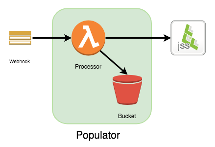

### Populator

- Attach to a Webhook Receiver.
    + Processes Computer/Mobile Device events only.
- Perform a return PUT operation on a device record if the serial number exists in an S3 data source.
- Requires a JSON/CSV file in a S3 bucket.

### Works With

- Webhook Receiver
