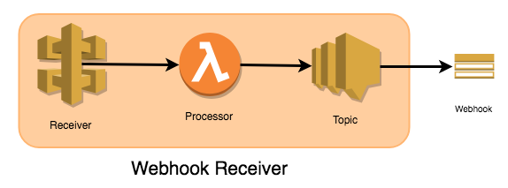

# Webhook Receiver

- Creates an API Gateway to receive webhook events.
- Creates SNS topic to publish events to.
- Supports optional token authentication (as a query string parameter).
- Supports basic authentication (username:password).

### Works With

- Populator
- Slack Notification
