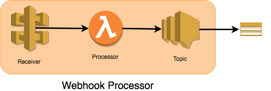
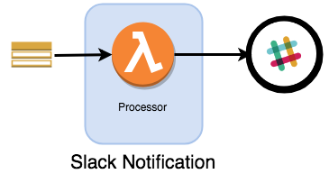
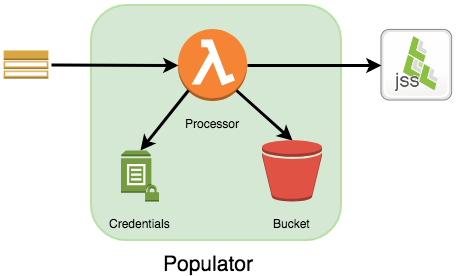

# Project Voltron

A concept for a modular plugin architecture for Jamf Pro available through the [AWS Serverless Application Repository](https://aws.amazon.com/serverless/serverlessrepo/).

## How it works

Integrations to Jamf Pro using the available APIs will normally all work using the same basic building blocks: an event receiver or a scheduled API request triggering notifications and/or business logic to act on the results.

An integration could be as simple as a notification service to a chat app (e.g. Slack), or more robust where multiple actions need to be chained off a single event - such as device enrollment. One particular integration may not fit for all Jamf Pro admins.

Project Voltron is a conceptual project that takes advantage of the AWS Serverless Application Repository to allow an admin to quickly create webhook and API based integrations to Jamf Pro with a wide variety of options allowing simple combinations of actions or more complex processing of numerous actions in parallel.

### Slack example

The most basic type of integration is the chat notification. The two required components for this are available as a part of Project Voltron:

* Webhook Receiver app (WR1)
* Slack Notification app (SN1)

To create this, you would go in your AWS account console to `Lambda > Create function > Serverless Application Respository` and search for the required components.

You would first create WR1 and then SN1 after. SN1 requires two parameters to be provided: then name given to WR1 and the Slack Inbound Webhook URL. Passing WR1's name automatically links SN1 to the events received by WR1 - no further configuration!

If you want to send notifications to multiple Slack channels you just need to add additional Slack Notification apps and reference WR1. Or, you can launch additional Webhook Receiver apps and link to those.

## Components:

* Webhook Receiver
    - Creates an API Gateway to receive webhook events.
    - Creates SNS topic to publish events to.

    
* Slack Notification
    - Attach to a Webhook Processor to send notifications to a Slack channel.
    - Events can be filtered to prevent notifications.

* Credentials
    - Save a Jamf Pro account username and password into Parameter Store for use by other components that call the Jamf Pro API.

* Poller
    - Run scheduled read operations using the Jamf Pro API.
        + Smart Groups
        + Advanced Searches

* Populator
    - Attach to a Webhook Processor.
        + Computer/Mobile Devices only.
    - Perform a return PUT operation on a device record if the serial number exists in an S3 data source.
    - Requires a JSON/CSV file in a S3 bucket.

* Custom HTTP Passthrough
    - Passthrough posting of a Jamf Pro webhook to another HTTP resource.
    - Can customize the passthrough request headers.

* Custom Function
    - Provide the name of another Lambda function in your AWS account to invoke on an event.
