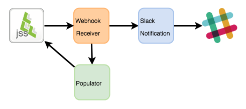
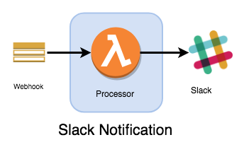
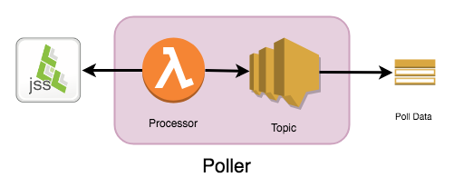

# Project Voltron

A concept for a modular plugin architecture for Jamf Pro available through the [AWS Serverless Application Repository](https://aws.amazon.com/serverless/serverlessrepo/).

## How it works

Integrations to Jamf Pro using the available APIs will normally all work using the same basic building blocks: an event receiver or a scheduled API request triggering notifications and/or business logic to act on the results.

An integration could be as simple as a notification service to a chat app (e.g. Slack), or more robust where multiple actions need to be chained off a single event - such as device enrollment. One particular integration may not fit for all Jamf Pro admins.

Project Voltron is a conceptual project that takes advantage of the AWS Serverless Application Repository to allow an admin to quickly create webhook and API based integrations to Jamf Pro with a wide variety of options allowing simple combinations of actions or more complex processing of numerous actions in parallel.

### Examples

The most basic type of integration is the chat notification. The two required components for this are a Webhook Receiver and a Slack Notification.

To create this, you would go in your AWS account console to `Lambda > Create function > Serverless Application Respository` and search for the required components. Create the Webhook Receiver first, and then reference it's name when you create the Slack Notification (linking them in the process).

In the diagram above, Jamf Pro sends webhooks to the Webhook Receiver, which publishes them to an internal SNS Topic that the Slack Notification is subscribed to. Each event is published as a formatted message to the target Slack channel.

Because of the modular design of Project Voltron, you can expand upon this beginning integration by adding in additional actions.

Assume this Slack integration was built to notify a channel about device enrollments. If, in addition to notifications, you needed to automatically update data on those device records as they enrolled you could link a Populator to the Webhook Receiver which would be triggered on the same events.

The Populator component is added onto the existing integration without having to make changes or updates to the pre-existing ones. Now, as the Slack channel is being notified the device record is being automatically updated.

## Components:

### Webhook Receiver
- Creates an API Gateway to receive webhook events.
- Creates SNS topic to publish events to.
- Supports optional token authentication (as a query string parameter).
- Supports basic authentication (username:password).

    
### Slack Notification
- Attach to a Webhook Processor to send notifications to a Slack channel.
- Events can be filtered to prevent notifications.

### Poller
- Run scheduled read operations using the Jamf Pro API.
    + Smart Groups
    + Advanced Searches
- Creates SNS topic to publish API results to.

### Populator _(Planned)_
- Attach to a Webhook Processor.
    + Computer/Mobile Devices only.
- Perform a return PUT operation on a device record if the serial number exists in an S3 data source.
- Requires a JSON/CSV file in a S3 bucket.

### Reporter _(Planned)_
- Send email containing the results of a Poller in a variety of formats:
    + HTML table
    + CSV

### Custom HTTP Passthrough _(Planned)_
- Passthrough posting of a Jamf Pro webhook to another HTTP resource.
- Can customize the passthrough request headers.
- Attach to either a Webhook Receiver or Poller.

### Custom Function _(Planned)_
- Provide the name of another Lambda function in your AWS account to invoke on an event.
- Attach to either a Webhook Receiver or Poller.
